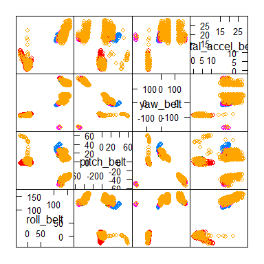
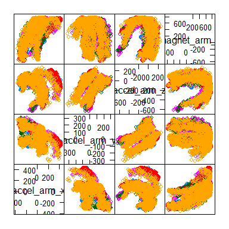
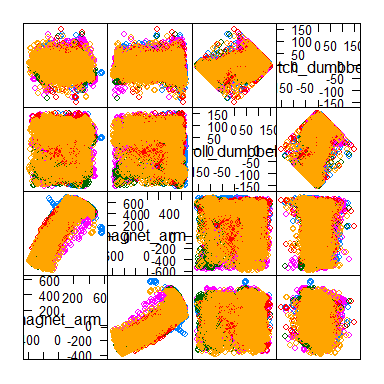
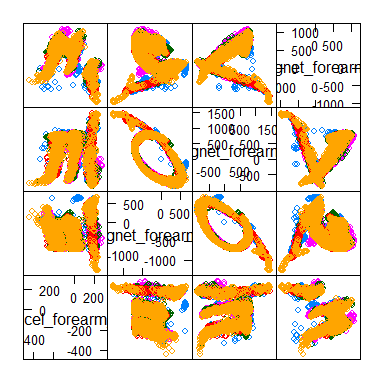
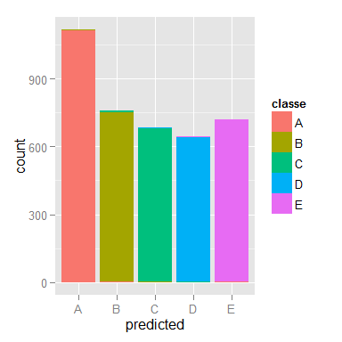
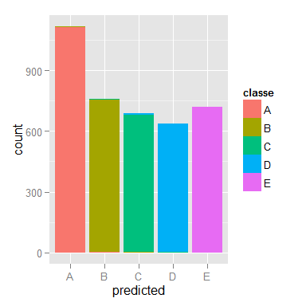

# Machine Learning: Qualitative Exercise Modelling and Prediction

###1. Introduction

With the explosion of methods to record data on personal performance through various devices that communicate with smart phones, an increasing number of users are using the data to evaluate their own performances - particularly quantitatively.  With data gathered from 6 participants performing dumbbell curls in a controlled environment, the attempt will be to train a predictive model on existing data to predict the qualitative execution of the exercise.  Data was provided by:  

Velloso, E.; Bulling, A.; Gellersen, H.; Ugulino, W.; Fuks, H. Qualitative Activity Recognition of Weight Lifting Exercises. Proceedings of 4th International Conference in Cooperation with SIGCHI (Augmented Human '13) . Stuttgart, Germany: ACM SIGCHI, 2013.

Read more: http://groupware.les.inf.puc-rio.br/har.#ixzz3HHJSDehS

###2. Setup

An initial dataset of 19 622 cases of 160 variables was supplied.  An additional test set, missing the response variable ***classe*** was also made available for the final testing of the predicticve function.

For the purposes of this machine learning project, the training set is first subdivided into a **training** (11 776 cases) and **testing** (7 846 cases) set on the  ***classe*** response variable - a random sample of 60% for the training set, and the remaining 40% for the initial testing set.  The testing set has been further subdivided into a **validation** (3 923 cases) set for fine tuning of the predictive model, and a **finalTest** (3 923 cases) set - the cases in the training set being randomly assigned to the validation and finalTest set on a 50/50 basis.

The validation dataset will be used to validate the models prior to running the final model against the finalTest set.


###3. Initial Data Exploration

A visual inspection of the *training* set highlighted the following:  
  
* The first 7 columns of the dataset contain data that are not directly applicable for use in training the predictive model, namely:  
      **a)** "x" : a numeric value that denotes the observation case (row) number  
      **b)** "user_name" : names of participant in the study  
      **c)** "raw_timestamp_part_1", "raw_timestamp_part_2", "cvtd_timestamp" : measure of time and date when the measurements were taken as the exercise was performed  
      **d)** "new_window", "num_window" : a window period that appears to denote each repitition of the exercise movement with the new_window variable encoding whether it's a
         new exercise repitition, and the num_window variable encoding which repition was measured at that point. 
* Various columns that contain missing data, either coded as empty strings "" or as NA.

###4. Data Clean-up

The following data clean-up and preparation steps were done on all the sets - training, validation & finalTest in order to prepare them for further analysis and modelling:    
  
* removing the non-applicable columns  
* replacing blank/empty string data with NA  
* removing division by 0 error codes (an artefact of the excel csv processing) to NA  
* ensuring that predictor classes are all numeric  
* encoding the response variable as a factor variable    
  
This reduced the available variables in each of the datasets to 153.


###5. Exploratory Analysis of Tidy Data - Dimensionality reduction.

As a general rule, a predictor with zero or near zero variance across all cases is not a good predictor when trying to discriminate between variables for accurate prediction.  A nearZeroVariance calculation was performed on all the predictor variables in the data set in order to identify any predictors that would not contribute to the robustness of the final prediction model.


```

FALSE  TRUE 
  124    29 
```

There were 29 predictors where there was either zero variance, near zero variance or both in the training data set. The training, validation and finalTest data sets were subset to exclude these predictors. Note that the same predictors were removed from the validation and finalTest sets based on the result of the training analysis, the NZV function was not performed anew on these.


```r
## susetting on zero variance
modelTrain <- modelTrain[,((nzv$zeroVar == FALSE) & (nzv$nzv == FALSE))]
modelValid <- modelValid[,((nzv$zeroVar == FALSE) & (nzv$nzv == FALSE))]
modelFinTest <- modelFinTest[,((nzv$zeroVar == FALSE) & (nzv$nzv == FALSE))]
```

The resulting data sets each had 124 variables available for further analysis - 123 predictors and one response variable.

A missing data test was run on the training data frame to determine how many of the predictors had missing values.  


```
lv2
    0 11528 11529 11531 11534 11550 11578 11580 11581 
   53    47     2     6     4     2     4     4     2 
```

A further call was made that any predictor with more than half of the cases (> 5 000) encoded as having missing data, would be removed from the modelling process.  These tests were run on the training dataset, and the same variables identified were removed from the validation and finalTest set as well.  The resulting data sets were saved as modelTrainNA, modelValidNA and modelFinTestNA respectively.


```
lvNA
FALSE  TRUE 
   71    53 
```

This has left a greatly reduced number of predictor variables with sufficient data to use for modelling.

Some of the more interesting patterns observed in the data when plotting a scatter plot matrix on some of the remaining variables:

    

A pdf of scatterplot matrix exploration of the full original dataset can be found on https://github.com/Chaendryn/PracMahineLearn_Project

###5. Training

With the remaining predictor variables (52) and a single response variable, a Random Forest modelling algorithm was selected for training.  The first model was fit on the full 53 variable data set.  


```r
library(caret)
library(randomForest)

set.seed(197607)

##  Full dataset Random Forest fit
modelFitRF1 <- randomForest(classe ~., data = modelTrainNA)
modelFitRF1
```

```

Call:
 randomForest(formula = classe ~ ., data = modelTrainNA) 
               Type of random forest: classification
                     Number of trees: 500
No. of variables tried at each split: 7

        OOB estimate of  error rate: 0.74%
Confusion matrix:
     A    B    C    D    E class.error
A 3342    5    0    0    1    0.001792
B   11 2259    9    0    0    0.008776
C    0   18 2032    4    0    0.010711
D    0    0   27 1901    2    0.015026
E    0    0    2    8 2155    0.004619
```

The OOB (out of bag) sample error rate for the model is listed as 0.74%.  We expect the out-of-sample error rate to be similar or slightly higher when we run the model against a validation and test set, but it should not be completely out of the ballpark.

###6. Testing the Model


```r
## prediction test on validation data
predValRF1 <- predict(modelFitRF1, newdata = validation)
```

Using the model **modelfitRF1** against the ***validation*** data set to predict the response variables for the validation, the resulting confusion matrix is as follows:


```r
confusionMatrix(predValRF1, validation$classe)
```

```
Confusion Matrix and Statistics

          Reference
Prediction    A    B    C    D    E
         A 1113    5    0    0    0
         B    2  750    6    0    0
         C    0    4  677    4    1
         D    0    0    1  638    4
         E    1    0    0    1  716

Overall Statistics
                                        
               Accuracy : 0.993         
                 95% CI : (0.989, 0.995)
    No Information Rate : 0.284         
    P-Value [Acc > NIR] : <2e-16        
                                        
                  Kappa : 0.991         
 Mcnemar's Test P-Value : NA            

Statistics by Class:

                     Class: A Class: B Class: C Class: D Class: E
Sensitivity             0.997    0.988    0.990    0.992    0.993
Specificity             0.998    0.997    0.997    0.998    0.999
Pos Pred Value          0.996    0.989    0.987    0.992    0.997
Neg Pred Value          0.999    0.997    0.998    0.998    0.998
Prevalence              0.284    0.193    0.174    0.164    0.184
Detection Rate          0.284    0.191    0.173    0.163    0.183
Detection Prevalence    0.285    0.193    0.175    0.164    0.183
Balanced Accuracy       0.998    0.993    0.993    0.995    0.996
```

  

An overall accuracy of 0.9926 provides us with an out-of-sample error rate of just 0.74% on the ***validation***, which is the same as the predicted OOB sample error rate from the model.   


```
         actual
predicted    A    B    C    D    E
        A 1113    5    0    0    0
        B    2  750    6    0    0
        C    0    4  677    4    1
        D    0    0    1  638    4
        E    1    0    0    1  716
```

Using the model **modelfitRF1** against the ***fintalTest*** data set to predict the response variables for the ***finalTest***, the resulting confusion matrix is as follows:


```r
## prediction Test on test data
predfinTestRF1 <- predict(modelFitRF1, newdata = finalTest)
confusionMatrix(predfinTestRF1, finalTest$classe)
```

```
Confusion Matrix and Statistics

          Reference
Prediction    A    B    C    D    E
         A 1114    4    0    0    0
         B    2  752    6    0    0
         C    0    3  677    7    1
         D    0    0    1  636    1
         E    0    0    0    0  719

Overall Statistics
                                        
               Accuracy : 0.994         
                 95% CI : (0.991, 0.996)
    No Information Rate : 0.284         
    P-Value [Acc > NIR] : <2e-16        
                                        
                  Kappa : 0.992         
 Mcnemar's Test P-Value : NA            

Statistics by Class:

                     Class: A Class: B Class: C Class: D Class: E
Sensitivity             0.998    0.991    0.990    0.989    0.997
Specificity             0.999    0.997    0.997    0.999    1.000
Pos Pred Value          0.996    0.989    0.984    0.997    1.000
Neg Pred Value          0.999    0.998    0.998    0.998    0.999
Prevalence              0.284    0.193    0.174    0.164    0.184
Detection Rate          0.284    0.192    0.173    0.162    0.183
Detection Prevalence    0.285    0.194    0.175    0.163    0.183
Balanced Accuracy       0.998    0.994    0.993    0.994    0.999
```

The same test on the ***finalTest*** data indicated a slightly lower out-of-sample error rate of only 0.6%.

  


```
         actual
predicted    A    B    C    D    E
        A 1114    4    0    0    0
        B    2  752    6    0    0
        C    0    3  677    7    1
        D    0    0    1  636    1
        E    0    0    0    0  719
```

###7. Cross Validation
A random forest cross validation was run to review expected out-of-sample error rates and to see whether there was a possible reduced number or variables that could be reliably used to predict an acceptable level of accuracy.


```r
## Random Forest Crossvalidation
predictors <- (length(modelTrainNA)-1)
responses <- as.numeric(length(modelTrainNA))

rfcvMod1 <- rfcv(trainx = modelTrainNA[,1:52], trainy = modelTrainNA[,53])
rfcvMod1$error.cv
```

```
      52       26       13        6        3        1 
0.008832 0.011974 0.014776 0.050442 0.130350 0.607252 
```

The result of the cross validation showed an out-of-sample error rate of 0.8832% for the full 53 variable set (52 predictors and 1 response).  In addition, the 1.1974% error rate on the 26 variable data set (25 predictors and 1 response) indicated that this could be a viable alternative model for prediction.
  
Therefore a Principal Component Analysis function was performed on the training set to determine whether it would identify a similar number of predictors that would account for 95% of the variability. 


```r
## Further dimension reduction process
preObjPCA <- preProcess(modelTrainNA[,-53], method = c("pca"))
preObjPCA
```

```

Call:
preProcess.default(x = modelTrainNA[, -53], method = c("pca"))

Created from 11776 samples and 52 variables
Pre-processing: principal component signal extraction, scaled, centered 

PCA needed 25 components to capture 95 percent of the variance
```

Prediction variables were generated from the preProcessing object in order to prepare a model and test it against the validation and finalTest data sets.


```r
trainPC <- predict(preObjPCA, newdata = modelTrainNA[ ,1:predictors])
validPC <- predict(preObjPCA, newdata = modelValidNA[ ,1:predictors])
testPC <- predict(preObjPCA, newdata = modelFinTestNA[ ,1:predictors])
```

###8. Alternative Model Test with PCA pre-processing


```r
## Creating model for PCA dimension reduction
set.seed(197607)
modFitRFPre1 <- randomForest(modelTrainNA$classe ~., data = trainPC)
modFitRFPre1
```

```

Call:
 randomForest(formula = modelTrainNA$classe ~ ., data = trainPC) 
               Type of random forest: classification
                     Number of trees: 500
No. of variables tried at each split: 5

        OOB estimate of  error rate: 3.19%
Confusion matrix:
     A    B    C    D    E class.error
A 3309   14   13   10    2     0.01165
B   46 2184   41    2    6     0.04168
C    8   32 1974   29   11     0.03895
D    4    1   98 1821    6     0.05648
E    0   11   19   23 2112     0.02448
```

The OOB error rate estimate is significantly higher on the reduced sample set.  A test against the validation and finTest data sets will show whether this is a true reflection of the out of sample error rate.

###9. Testing PCA model fit on Validation and FinalTest data


```r
## prediction Test on validation data
predValRFPre1 <- predict(modFitRFPre1, newdata = validPC)
confusionMatrix(predValRFPre1, validation$classe)
```

```
Confusion Matrix and Statistics

          Reference
Prediction    A    B    C    D    E
         A 1108   17    0    1    1
         B    5  714   11    0    1
         C    2   25  663   20   10
         D    1    0    7  619    6
         E    0    3    3    3  703

Overall Statistics
                                        
               Accuracy : 0.97          
                 95% CI : (0.965, 0.976)
    No Information Rate : 0.284         
    P-Value [Acc > NIR] : <2e-16        
                                        
                  Kappa : 0.963         
 Mcnemar's Test P-Value : NA            

Statistics by Class:

                     Class: A Class: B Class: C Class: D Class: E
Sensitivity             0.993    0.941    0.969    0.963    0.975
Specificity             0.993    0.995    0.982    0.996    0.997
Pos Pred Value          0.983    0.977    0.921    0.978    0.987
Neg Pred Value          0.997    0.986    0.993    0.993    0.994
Prevalence              0.284    0.193    0.174    0.164    0.184
Detection Rate          0.282    0.182    0.169    0.158    0.179
Detection Prevalence    0.287    0.186    0.184    0.161    0.181
Balanced Accuracy       0.993    0.968    0.976    0.979    0.986
```

```r
## prediction Test on test data
predFinTestRFPre1 <- predict(modFitRFPre1, newdata = testPC)
confusionMatrix(predFinTestRFPre1, finalTest$classe)
```

```
Confusion Matrix and Statistics

          Reference
Prediction    A    B    C    D    E
         A 1106   15    2    0    0
         B    6  720   15    0    4
         C    2   22  659   29    4
         D    1    0    7  614    8
         E    1    2    1    0  705

Overall Statistics
                                        
               Accuracy : 0.97          
                 95% CI : (0.964, 0.975)
    No Information Rate : 0.284         
    P-Value [Acc > NIR] : <2e-16        
                                        
                  Kappa : 0.962         
 Mcnemar's Test P-Value : NA            

Statistics by Class:

                     Class: A Class: B Class: C Class: D Class: E
Sensitivity             0.991    0.949    0.963    0.955    0.978
Specificity             0.994    0.992    0.982    0.995    0.999
Pos Pred Value          0.985    0.966    0.920    0.975    0.994
Neg Pred Value          0.996    0.988    0.992    0.991    0.995
Prevalence              0.284    0.193    0.174    0.164    0.184
Detection Rate          0.282    0.184    0.168    0.157    0.180
Detection Prevalence    0.286    0.190    0.183    0.161    0.181
Balanced Accuracy       0.992    0.970    0.973    0.975    0.988
```

From the above confusion matrices, it can be seen that the dimensionality reduction from 53 to 26 variables had a minor impact on the overall accuracy of the model and can therefore be used for predicting the outcome of the dumbbell curl excersize.

###10. Conclusion
From the initial 160 variables associated with the outcome of the exercise, a reduced model of 53 variables can be used to predict the outcome on new data with a ~99% accuracy.  26 variables with Principal Component Analysis brings the accuracy down to ~97%, which is still well within the bounds of being reasonable.  

From the cross validation run, a 13 variable data set has an error rate of only 0.014776 which is only marginally larger than the 26 variable error rate of 0.011974.  Halving the number of required variables to provide similar accuracy could be a viable avenue for additional research, especially for rolling this out to a broader market for everyday use.


